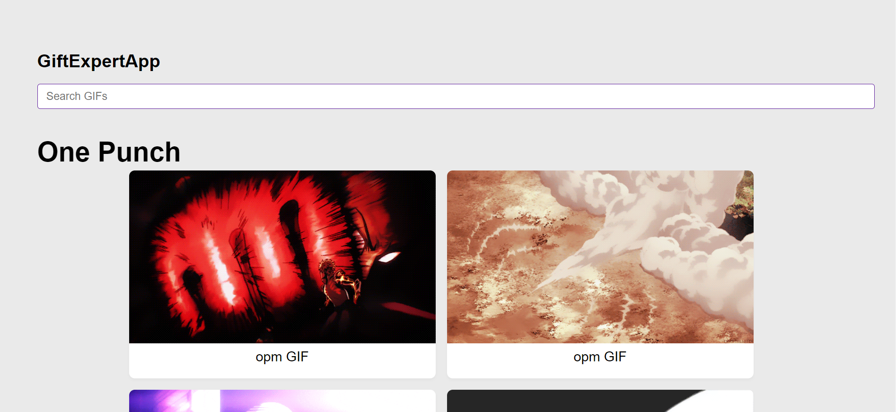

# Gif Expert App

Gifs gallery with Giphy API. React App created with vite.

Learning:

1. Unit and components tests with Jest and React Testing library.
2. Creation and configuration of a Vite app.
3. PropTypes validations.

# Deployment

GITHUB PAGES:

[LINK](https://josuelara0.github.io/gif-expert-app/)

## Screenshot

## Libraries and tools

1.  [REACT](https://en.reactjs.org/)
2.  [JEST](https://jestjs.io/)
3.  [TESTING LIBRARY](https://testing-library.com/)
4.  [VITE](https://vitejs.dev/)
5.  [PROPTYPES](https://es.reactjs.org/docs/typechecking-with-proptypes.html)

## Install and run project

1. Clone repo.
2. Install modules `yarn install`.
3. Make an account and get an api key in [GIPHY](https://giphy.com/).
4. Check .env.example file and create a `.env` file.
5. Run project `yarn dev`.
6. Run tests `yarn test`.
